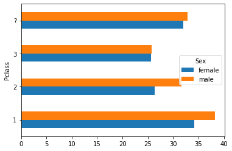

# Section Recap

## Introduction

In this section you saw how to wrangle and clean data in Pandas! This will be a baseline skill that you will use consistently in your work whether it's doing sanity checks, cleaning messy data or transforming raw datasets into useful aggregates and views. Having an understanding of the format of your data is essential to critically thinking about how you can manipulate and shape it into new and interesting forms.


## Lambda functions

We started out by introducing lambda functions. These are quick throw away functions that you can write on the fly. They're very useful for transforming a column feature. For example, you might want to extract the day from a date.


```python
import pandas as pd
dates = pd.Series(['12-01-2017', '12-02-2017', '12-03-2017', '12-04-2017'])
dates.map(lambda x: x.split('-')[1])
```


    0    01
    1    02
    2    03
    3    04
    dtype: object


## Combining DataFrames

You can combine dataframes by merging them (joining data by a common field) or concatenating them (appending data at the beginning or end).


```python
df1 = pd.DataFrame(dates)
df2 = pd.DataFrame(['12-05-2017', '12-06-2017', '12-07-2017'])
pd.concat([df1, df2])
```


<div>
<style scoped>
    .dataframe tbody tr th:only-of-type {
        vertical-align: middle;
    }

    .dataframe tbody tr th {
        vertical-align: top;
    }

    .dataframe thead th {
        text-align: right;
    }
</style>
<table border="1" class="dataframe">
  <thead>
    <tr style="text-align: right;">
      <th></th>
      <th>0</th>
    </tr>
  </thead>
  <tbody>
    <tr>
      <th>0</th>
      <td>12-01-2017</td>
    </tr>
    <tr>
      <th>1</th>
      <td>12-02-2017</td>
    </tr>
    <tr>
      <th>2</th>
      <td>12-03-2017</td>
    </tr>
    <tr>
      <th>3</th>
      <td>12-04-2017</td>
    </tr>
    <tr>
      <th>0</th>
      <td>12-05-2017</td>
    </tr>
    <tr>
      <th>1</th>
      <td>12-06-2017</td>
    </tr>
    <tr>
      <th>2</th>
      <td>12-07-2017</td>
    </tr>
  </tbody>
</table>
</div>


## Grouping and aggregating


```python
df = pd.read_csv('titanic.csv')
df.head()
```


<div>
<style scoped>
    .dataframe tbody tr th:only-of-type {
        vertical-align: middle;
    }

    .dataframe tbody tr th {
        vertical-align: top;
    }

    .dataframe thead th {
        text-align: right;
    }
</style>
<table border="1" class="dataframe">
  <thead>
    <tr style="text-align: right;">
      <th></th>
      <th>PassengerId</th>
      <th>Survived</th>
      <th>Pclass</th>
      <th>Name</th>
      <th>Sex</th>
      <th>Age</th>
      <th>SibSp</th>
      <th>Parch</th>
      <th>Ticket</th>
      <th>Fare</th>
      <th>Cabin</th>
      <th>Embarked</th>
    </tr>
  </thead>
  <tbody>
    <tr>
      <th>0</th>
      <td>1.0</td>
      <td>0.0</td>
      <td>3</td>
      <td>Braund, Mr. Owen Harris</td>
      <td>male</td>
      <td>22.0</td>
      <td>1.0</td>
      <td>0.0</td>
      <td>A/5 21171</td>
      <td>7.2500</td>
      <td>NaN</td>
      <td>S</td>
    </tr>
    <tr>
      <th>1</th>
      <td>2.0</td>
      <td>1.0</td>
      <td>1</td>
      <td>Cumings, Mrs. John Bradley (Florence Briggs Th...</td>
      <td>female</td>
      <td>38.0</td>
      <td>1.0</td>
      <td>0.0</td>
      <td>PC 17599</td>
      <td>71.2833</td>
      <td>C85</td>
      <td>C</td>
    </tr>
    <tr>
      <th>2</th>
      <td>3.0</td>
      <td>1.0</td>
      <td>3</td>
      <td>Heikkinen, Miss. Laina</td>
      <td>female</td>
      <td>26.0</td>
      <td>0.0</td>
      <td>0.0</td>
      <td>STON/O2. 3101282</td>
      <td>7.9250</td>
      <td>NaN</td>
      <td>S</td>
    </tr>
    <tr>
      <th>3</th>
      <td>4.0</td>
      <td>1.0</td>
      <td>1</td>
      <td>Futrelle, Mrs. Jacques Heath (Lily May Peel)</td>
      <td>female</td>
      <td>35.0</td>
      <td>1.0</td>
      <td>0.0</td>
      <td>113803</td>
      <td>53.1000</td>
      <td>C123</td>
      <td>S</td>
    </tr>
    <tr>
      <th>4</th>
      <td>5.0</td>
      <td>0.0</td>
      <td>3</td>
      <td>Allen, Mr. William Henry</td>
      <td>male</td>
      <td>35.0</td>
      <td>0.0</td>
      <td>0.0</td>
      <td>373450</td>
      <td>8.0500</td>
      <td>NaN</td>
      <td>S</td>
    </tr>
  </tbody>
</table>
</div>


```python
grouped = df.groupby(['Pclass', 'Sex'])['Age'].mean().reset_index()
grouped.head()
```


<div>
<style scoped>
    .dataframe tbody tr th:only-of-type {
        vertical-align: middle;
    }

    .dataframe tbody tr th {
        vertical-align: top;
    }

    .dataframe thead th {
        text-align: right;
    }
</style>
<table border="1" class="dataframe">
  <thead>
    <tr style="text-align: right;">
      <th></th>
      <th>Pclass</th>
      <th>Sex</th>
      <th>Age</th>
    </tr>
  </thead>
  <tbody>
    <tr>
      <th>0</th>
      <td>1</td>
      <td>female</td>
      <td>34.098291</td>
    </tr>
    <tr>
      <th>1</th>
      <td>1</td>
      <td>male</td>
      <td>38.287799</td>
    </tr>
    <tr>
      <th>2</th>
      <td>2</td>
      <td>female</td>
      <td>26.338992</td>
    </tr>
    <tr>
      <th>3</th>
      <td>2</td>
      <td>male</td>
      <td>31.630340</td>
    </tr>
    <tr>
      <th>4</th>
      <td>3</td>
      <td>female</td>
      <td>25.677973</td>
    </tr>
  </tbody>
</table>
</div>


## Pivot tables


```python
pivoted = grouped.pivot(index='Pclass', columns = 'Sex', values='Age')
pivoted
```


<div>
<style scoped>
    .dataframe tbody tr th:only-of-type {
        vertical-align: middle;
    }

    .dataframe tbody tr th {
        vertical-align: top;
    }

    .dataframe thead th {
        text-align: right;
    }
</style>
<table border="1" class="dataframe">
  <thead>
    <tr style="text-align: right;">
      <th>Sex</th>
      <th>female</th>
      <th>male</th>
    </tr>
    <tr>
      <th>Pclass</th>
      <th></th>
      <th></th>
    </tr>
  </thead>
  <tbody>
    <tr>
      <th>1</th>
      <td>34.098291</td>
      <td>38.287799</td>
    </tr>
    <tr>
      <th>2</th>
      <td>26.338992</td>
      <td>31.630340</td>
    </tr>
    <tr>
      <th>3</th>
      <td>25.677973</td>
      <td>25.757624</td>
    </tr>
    <tr>
      <th>?</th>
      <td>32.011356</td>
      <td>32.862597</td>
    </tr>
  </tbody>
</table>
</div>


## Graphing


```python
import matplotlib.pyplot as plt
%matplotlib inline
pivoted.plot(kind='barh')
```


    <matplotlib.axes._subplots.AxesSubplot at 0x121802828>





## Missing data


```python
print('Top 5 Values before:\n', df['Cabin'].value_counts(normalize=True).reset_index()[:5])
# Not a useful means of imputing in most cases, but a simple example to recap
df.Cabin = df['Cabin'].fillna(value='?')
print('Top 5 Values after:\n', df.Cabin.value_counts(normalize=True).reset_index()[:5])
```

    Top 5 Values before:
              index     Cabin
    0         E121  0.013289
    1          A20  0.013289
    2          B41  0.013289
    3  C23 C25 C27  0.011628
    4          E38  0.011628
    Top 5 Values after:
       index     Cabin
    0     ?  0.567218
    1   B41  0.005751
    2  E121  0.005751
    3   A20  0.005751
    4   E38  0.005032


## Summary

In this lesson, you started practicing essential ETL skills that you will use throughout your data work to transform and wrangle data into useful forms.
